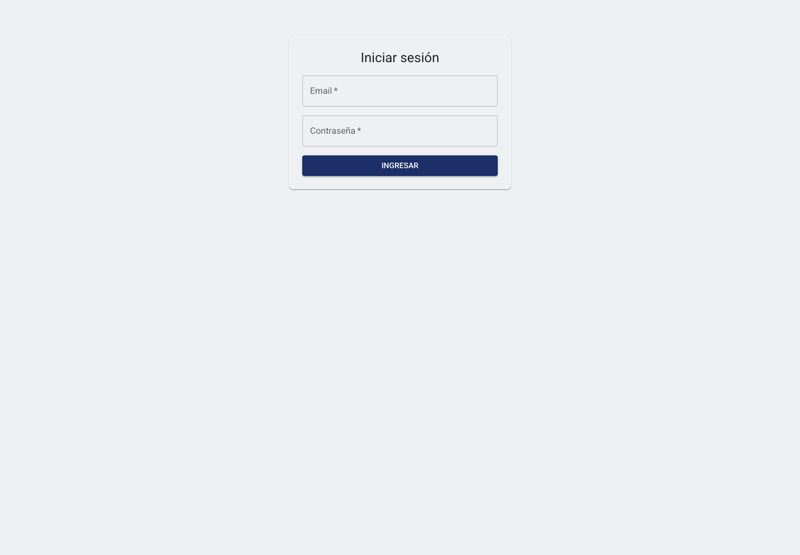
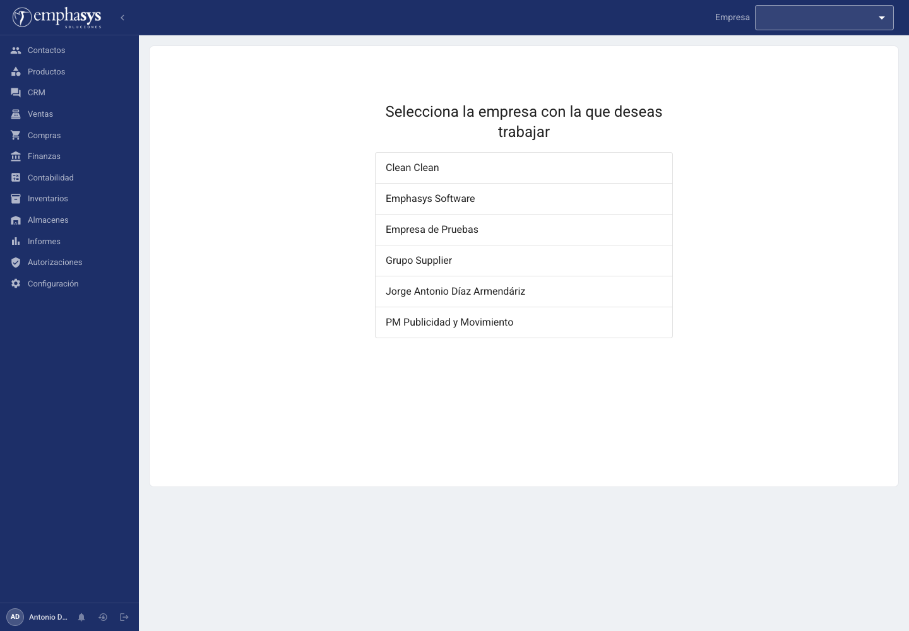
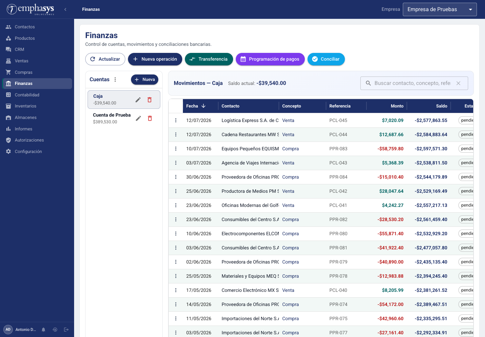
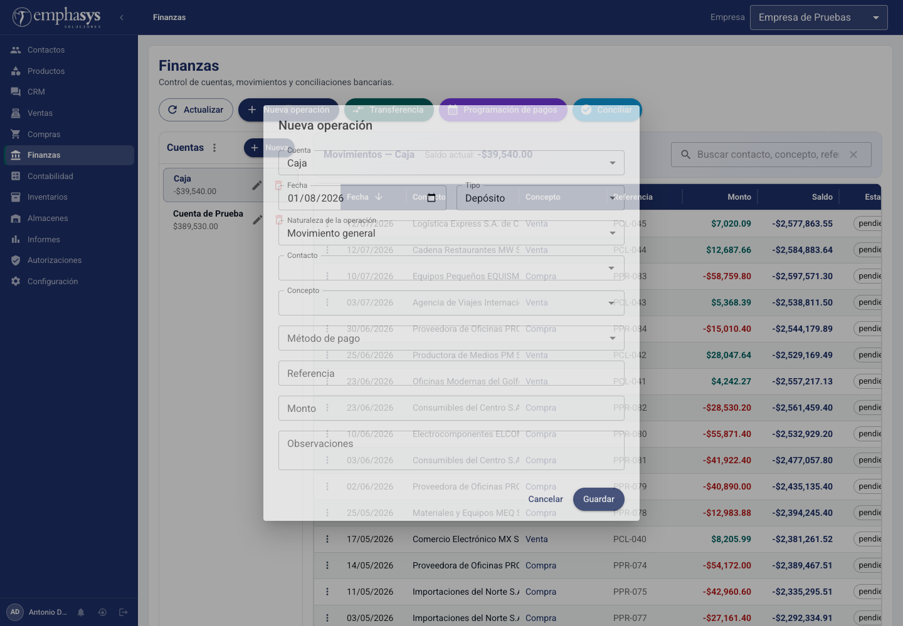
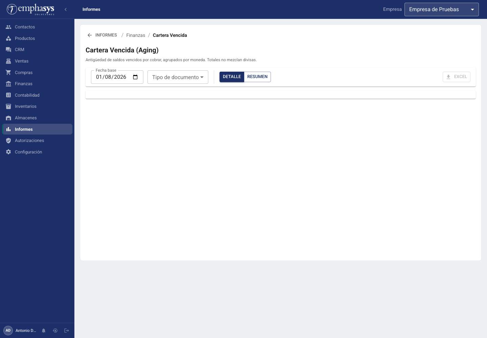
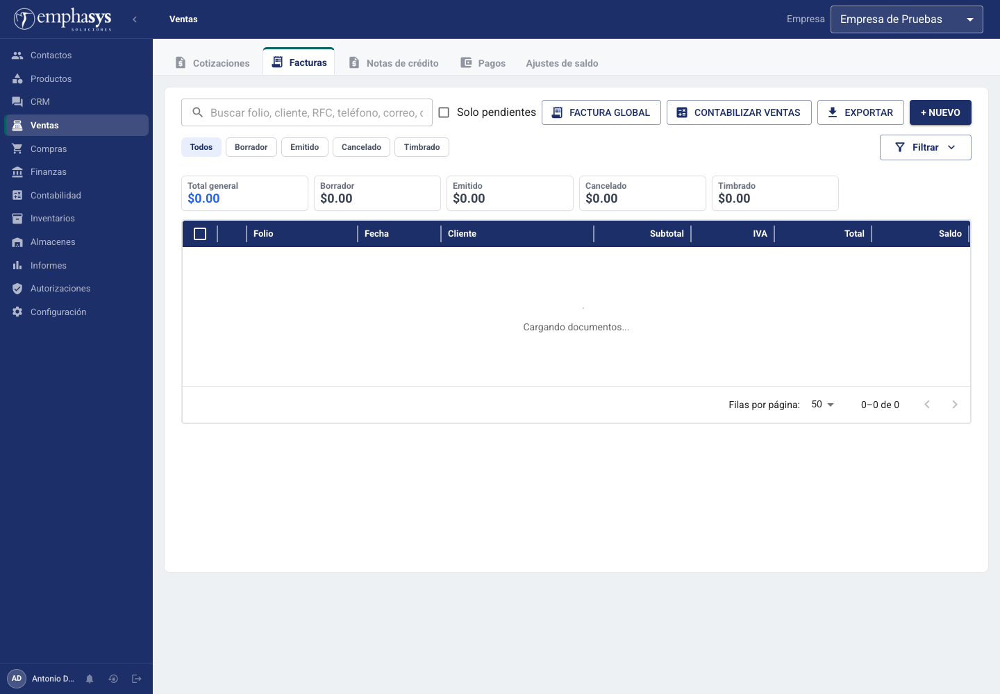
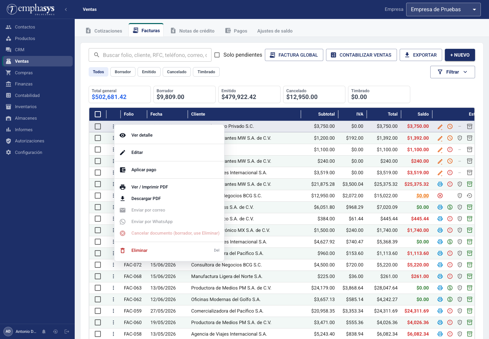
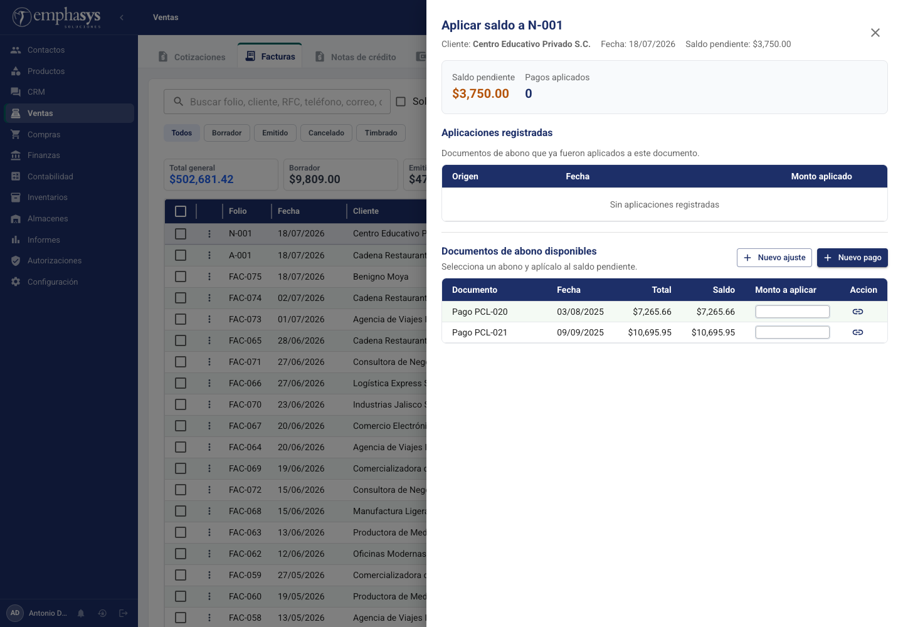
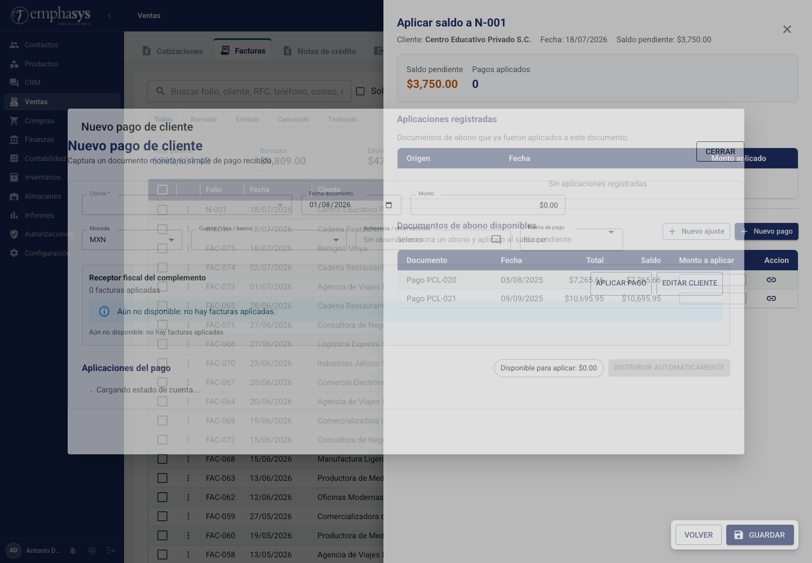

# Cobranza en Emphasys ERP

> Estado de la revisión: auditoría de código y recorrido autenticado completados el 1 de agosto de 2026 con el usuario proporcionado y la empresa **Empresa de Pruebas**. Se trabajó en modo lectura: no se guardaron, aplicaron, editaron, cancelaron ni eliminaron datos.

## Objetivo

El flujo de Cobranza permite consultar las cuentas por cobrar de clientes, registrar cobros, crear documentos de pago o ajuste, aplicar esos abonos a facturas, revertir aplicaciones autorizadas y consultar reportes de vencimientos, pagos recibidos, estado de cuenta y cartera vencida.

En la interfaz actual no existe un módulo independiente llamado **Cobranza**. El flujo está repartido entre:

- **Ventas > Facturas**, donde se consulta una factura y se abre el panel de pagos/aplicaciones.
- **Finanzas**, donde se administran cuentas y movimientos, incluidos los de naturaleza `cobro_cliente`.
- **Informes > Finanzas**, para Vencimientos de Clientes, Pagos Recibidos y Cartera Vencida.
- **Informes > Ventas**, para Estado de Cuenta de Cliente.
- **Configuración > Métodos de pago**, catálogo utilizado por los movimientos.

## Acceso

1. Abrir `http://localhost:5173/login`.
2. Capturar **Email** y **Contraseña**.
3. Pulsar **Ingresar**.
4. Si el usuario sólo tiene una empresa, el sistema la selecciona automáticamente; con varias empresas dirige a **Seleccionar empresa**.
5. La sesión requiere JWT y una empresa activa para todas las rutas financieras.

### Validaciones y errores de acceso

- Ambos campos están marcados como obligatorios en HTML/MUI, aunque el formulario usa `noValidate`; la validación efectiva depende del backend.
- Mientras se procesa el acceso, el botón muestra **Ingresando...** y queda deshabilitado.
- Un fallo muestra el mensaje devuelto por el servicio o **Error al iniciar sesión**.
- Un usuario sin empresa activa no puede llamar los endpoints de Finanzas.

## Recorrido funcional

### 1. Consultar la cartera desde una factura

1. Ir a **Ventas > Facturas**.
2. Abrir una factura de venta.
3. Abrir su acción de pagos/aplicaciones.
4. Revisar el panel **Aplicar saldo a [folio]**.
5. Consultar saldo pendiente, pagos aplicados y documentos de abono disponibles.
6. Crear un pago o ajuste, o aplicar un documento ya existente.

El panel presenta:

- cliente, fecha y saldo pendiente;
- total de aplicaciones registradas;
- tabla de aplicaciones: origen, fecha, monto aplicado y, cuando procede, acción de desaplicar;
- tabla de documentos disponibles: documento, fecha, total, saldo, monto a aplicar y acción;
- botones **Nuevo ajuste**, **Nuevo pago** y, para notas de crédito, **Aplicar automáticamente**.

#### Campos al aplicar un documento

| Campo | Uso | Regla |
|---|---|---|
| Monto a aplicar | Importe que se cruza contra la factura | Si queda vacío, la ayuda indica que se usa el saldo disponible. Debe ser mayor que cero. |
| Documento origen | Pago, ajuste o nota de crédito disponible | Debe tener saldo disponible, misma empresa/contacto compatible y moneda coherente. |
| Documento destino | Factura que se está consultando | Debe conservar saldo pendiente. |
| Fecha de aplicación | Fecha contable de la aplicación | El backend acepta fecha opcional y registra la operación de forma transaccional. |

#### Validaciones visibles

- **Saldo del documento agotado**.
- **No hay saldo disponible para aplicar**.
- **Ingresa un monto valido (> 0)**.
- **El monto excede el saldo del documento**.
- **El monto excede el saldo documental disponible**.
- Una aplicación no puede dejar saldo insoluto negativo ni pagar más que el saldo anterior.
- El backend bloquea y vuelve a leer saldos dentro de una transacción para evitar sobreaplicaciones concurrentes.

#### Resultado

Al guardar, la aplicación aparece en la tabla, baja el saldo de la factura y baja el saldo disponible del documento de abono. La operación no equivale a una conciliación bancaria.

### 2. Crear un nuevo pago de cliente

Desde el panel de la factura, pulsar **Nuevo pago**. Se abre el formulario embebido **Nuevo pago de cliente** con:

- empresa, cuando está disponible en el documento;
- cliente bloqueado al cliente de la factura;
- fecha del día;
- moneda heredada de la factura (o MXN como respaldo);
- campos del tipo documental `pago_cliente` configurados en el sistema.

El formulario real incluye **Cliente**, **Fecha documento**, **Monto**, **Moneda**, **Cuenta / caja / banco**, **Referencia / observaciones**, **Forma de pago** y **Receptor fiscal del complemento**. También muestra las facturas pendientes del cliente y permite asignar importes con **Aplicar todo**, **Distribuir automáticamente** o captura manual antes de **Aplicar pago**. Después de guardar, el pago queda disponible y las asignaciones elegidas pueden materializarse como aplicaciones; no se guardó ningún ejemplo durante esta revisión.

### 3. Crear un ajuste de saldo

Pulsar **Nuevo ajuste**. Se abre **Nuevo ajuste de saldo de cliente** con el cliente bloqueado, fecha actual y moneda de la factura. El documento creado queda disponible para aplicarse.

### 4. Desaplicar un pago

1. Abrir una factura con una aplicación cuyo origen sea `pago_cliente`.
2. Pulsar el icono **Desaplicar pago**.
3. Capturar el **Motivo**.
4. Confirmar **Desaplicar** o cancelar.

El diálogo muestra folio del pago, folio de la factura e importe. El motivo es obligatorio en la interfaz y debe tener entre 5 y 500 caracteres; el backend limita a 500 caracteres. La acción restaura los saldos de pago y factura de forma transaccional, conserva una bitácora de reversión y no elimina el documento de pago.

Permiso: sólo superadministradores o usuarios con rol cuyo nombre sea `Administrador` o `Admin`. El backend vuelve a comprobar el permiso, por lo que ocultar o forzar el botón no basta.

En los datos demo revisados no existe una aplicación cuyo documento origen sea realmente `pago_cliente`; por ello no apareció el botón de papelera ni fue posible abrir el diálogo sin crear o alterar datos. Sí se confirmó el componente, endpoint, permiso y condición exacta en código. Una aplicación existente en `FAC-033` se presenta como **Factura 000**, no como pago de cliente, y por diseño no ofrece desaplicación.

### 5. Registrar un cobro desde Finanzas

1. Ir a **Finanzas**.
2. Elegir una cuenta.
3. Pulsar **Nueva operación**.
4. Registrar la naturaleza **Cobro de cliente**.
5. Guardar.

#### Campos de la operación

| Campo | Opciones/regla |
|---|---|
| Cuenta | Obligatoria; debe pertenecer a la empresa activa. |
| Fecha | Obligatoria. |
| Tipo | **Depósito** o **Retiro**. Para cobranza corresponde normalmente Depósito. |
| Naturaleza | **Cobro de cliente**, **Pago a proveedor** o **Movimiento general**. |
| Contacto | Cliente/varios para un cobro; permite crear un contacto sin salir del diálogo. |
| Concepto | Catálogo financiero; permite crear un concepto. |
| Método de pago | Catálogo operativo activo; puede quedar sin especificar. |
| Referencia | Obligatoria cuando el método seleccionado tiene `requiere_referencia`. |
| Monto | Obligatorio y mayor que cero. |
| Observaciones | Texto libre. |

#### Botones y acciones de Finanzas

- **Actualizar**: recarga cuentas y movimientos.
- **Nueva operación**: crear depósito/retiro; se deshabilita sin cuenta seleccionada.
- **Transferencia**: requiere al menos dos cuentas.
- **Programación de pagos**: pertenece a cuentas por pagar, no a Cobranza.
- **Conciliar**: abre conciliación bancaria para la cuenta seleccionada.
- **Nueva** (cuenta): crea una cuenta financiera.
- Editar/eliminar cuenta.
- Buscar por contacto, concepto, referencia o monto.
- Ver detalle: sólo está habilitado para movimientos con naturaleza `cobro_cliente`.
- Editar/eliminar movimiento mediante acciones de fila o menú contextual.
- **Recalcular saldos**: sólo se muestra a superadministradores y el backend también exige superadministrador.

Registrar un movimiento `cobro_cliente` en Finanzas no demuestra por sí solo que una factura quedó pagada: la relación documental se materializa mediante una aplicación de saldo. Esta distinción es esencial para soporte y capacitación.

### 6. Vencimientos de Clientes

Ruta: **Informes > Finanzas > Vencimientos de Clientes**.

Objetivo: listar facturas de venta con saldo, ordenadas por vencimiento.

Campos/filtros:

- **Fecha de corte** (por defecto hoy).
- **Cliente** (todos si queda vacío; busca contactos tipo cliente o varios).
- **Moneda**: Todas, MXN, USD o EUR; por defecto MXN.

Botones: **PDF**, **Excel**, **Informes** (regresar). Los cambios disparan la consulta automáticamente después de 500 ms; no existe botón “Consultar”.

Columnas: Vencimiento, Días, Cliente, Documento, Total y Saldo. Los días negativos se muestran como vencidos, cero como vence hoy. Los KPI son Vencido, Vence hoy, Próx. 7 días, Próx. 30 días y Total pendiente.

Errores de consulta/exportación se muestran en una notificación. Los botones de exportación se deshabilitan sin resultado o durante otra exportación.

### 7. Pagos Recibidos de Clientes

Ruta: **Informes > Finanzas > Pagos Recibidos (Clientes)**.

Filtros:

- **Desde**: primer día del mes por defecto.
- **Hasta**: hoy por defecto.
- **Cliente**: todos si queda vacío.
- **Cuenta**: todas si queda vacío.

La consulta se actualiza automáticamente después de 500 ms. El reporte muestra período, total y número de registros. Columnas: Fecha, Folio, Cliente, Cuenta, Monto, Moneda, Método, Referencia, Concepto y Conciliación. Acción disponible: **Excel**.

### 8. Estado de Cuenta de Cliente

Ruta: **Informes > Ventas > Estado de Cuenta de Cliente**.

Objetivo: consultar movimientos y saldo acumulado de un cliente hasta una fecha de corte. El reporte soporta vista estándar y análisis documental, incluye documentos cancelados opcionalmente y exporta Excel/CSV/PDF según la vista.

El análisis documental separa cada documento principal de sus aplicaciones y calcula total original, aplicado y saldo actual. Los documentos cancelados se muestran atenuados y no contribuyen al saldo operativo.

### 9. Cartera Vencida

Ruta: **Informes > Finanzas > Cartera Vencida**.

Filtros:

- **Fecha base** (hoy por defecto).
- **Tipo de documento**: Todos, Facturas de venta o Facturas de compra.
- Vista **Detalle** o **Resumen**.

Acción: **Excel**. La consulta se actualiza automáticamente.

Detalle: Cliente, Documento, Tipo, Fecha, Moneda, Saldo, Días vencido y Antigüedad. Resumen: cliente/moneda y buckets 0–30, 31–60, 61–90, 90+ y total. Los totales nunca mezclan monedas.

## Errores esperados

- 400: empresa, IDs, fechas o payload inválidos; monto/referencia/saldos no válidos.
- 401: sesión ausente o token inválido.
- 403: empresa no autorizada, desaplicación sin rol o recálculo sin superadministrador.
- 404: documento u operación no encontrada.
- 409: conflicto de estado/saldo o intento incompatible con datos ya procesados.
- 503: fallo de infraestructura durante una reversión; el mensaje indica que pago y factura conservaron sus saldos anteriores.
- Los componentes muestran el mensaje del backend y, si no existe, un texto genérico contextual.

## Permisos

| Capacidad | Control observado |
|---|---|
| Entrar a Finanzas e informes | Usuario autenticado con empresa activa. |
| Crear/editar/eliminar cuentas | No se encontró RBAC específico en las rutas de Finanzas; cualquier usuario autenticado de la empresa puede intentarlo. |
| Crear/editar/eliminar operaciones | Igual: autenticación + empresa activa, sin permiso granular en la ruta. |
| Crear/aplicar pagos o anticipos | Autenticación + empresa activa; reglas de empresa/documento/saldo en repositorio. |
| Desaplicar pago | Superadministrador o rol Admin/Administrador, comprobado en frontend y backend. |
| Recalcular saldos | Sólo superadministrador, comprobado en frontend y middleware backend. |
| Consultar/exportar informes | Autenticación + empresa activa; no se observó permiso granular por informe. |

## Reglas de negocio confirmadas en código

- Los datos se aíslan por `empresa_id` en las consultas financieras.
- Cuenta y documento deben pertenecer a la empresa activa.
- Depósitos suman al saldo; retiros restan.
- El saldo mostrado por movimiento se calcula cronológicamente por fecha e ID, no según el orden visual de la tabla.
- El monto de una operación debe ser positivo.
- Métodos marcados con `requiere_referencia` impiden guardar sin referencia.
- Las aplicaciones de saldo no pueden exceder el saldo del abono ni el de la factura.
- Las operaciones de aplicación y desaplicación usan transacciones y bloqueos para conservar consistencia.
- La moneda del documento/pago debe ser coherente; en programación de pagos el backend rechaza explícitamente una moneda distinta.
- Los documentos cancelados no aportan saldo operativo.
- El aging agrupa por moneda y no suma divisas distintas.
- Desaplicar restaura saldos y registra motivo/usuario; no borra el pago.
- Recalcular saldos reconstruye histórico y saldo actual sin eliminar operaciones.

## Diferencias y hallazgos entre interfaz y código

1. **No existe “Cobranza” como módulo o menú.** El objetivo de negocio existe, pero está fragmentado entre Ventas, Finanzas e Informes.
2. **Finanzas mezcla Cobranza, Tesorería y Cuentas por Pagar.** Los botones Programación de pagos, Transferencia y Conciliar no pertenecen estrictamente a Cobranza.
3. **La interfaz expone CRUD financiero con control amplio.** Salvo desaplicar y recalcular, las rutas sólo exigen autenticación y empresa activa; no hay RBAC granular para crear/eliminar cuentas u operaciones.
4. **Permiso de mantenimiento no equivale a rol administrador.** El botón Recalcular saldos sólo usa `es_superadmin`; un usuario con rol Administrador no lo ve y el backend tampoco lo autoriza.
5. **Desaplicar sí contempla rol administrador.** La UI acepta superadministrador o Admin/Administrador, alineada con la comprobación backend.
6. **El frontend exige motivo mínimo de 5 caracteres al desaplicar; el controller sólo valida el máximo de 500.** La regla mínima depende de la UI y podría no aplicarse a otro cliente API, salvo validación adicional en repositorio.
7. **“Pagos Recibidos” y “Aplicaciones” no son sinónimos.** Un cobro puede existir como operación/documento sin estar aplicado a una factura; la UI no lo explica en el menú de informes.
8. **Cartera Vencida ofrece Facturas de compra.** Aunque el texto dice “saldos por cobrar”, el filtro “Todos” incluye también cuentas por pagar, lo que desborda el alcance de Cobranza.
9. **Etiquetas menores sin acento.** En el panel aparecen textos como “Accion”, “esta vacio”, “se aplico” y “automaticamente”; conviene homologar ortografía.
10. **El login confía la validación real al backend.** Los campos tienen `required`, pero `noValidate` desactiva la validación nativa del formulario.
11. **Hay un diálogo de conciliación importado/montado pero el botón principal navega a otra pantalla.** El estado `conciliacionOpen` no se activa en la página actual; parece código legado o una ruta alternativa sin acceso visible.
12. **El formulario real de Nuevo pago permite distribuir el pago entre facturas antes de guardarlo.** La lectura aislada de `FacturaPagosDrawer` sugería un flujo en dos pasos; la navegación confirmó que el formulario documental embebido ya incluye la asignación de facturas.
13. **Una aplicación demo se etiqueta como “Factura 000”.** En `FAC-033` existe una aplicación por $1,870.62, pero el origen no se resuelve como pago de cliente. Esto explica que no aparezca Desaplicar y señala datos históricos o tipificación inconsistente.
14. **El menú Aplicar pago aparece incluso en un documento borrador.** La primera fila recorrida fue `N-001`; el panel permitió preparar una aplicación con saldo pendiente de $3,750.00. Conviene confirmar si el negocio desea permitir cobranza sobre borradores.

## Evidencia visual

### Acceso y selección de empresa

### Operación financiera

### Reportes de Cobranza

### Facturas y aplicaciones

## Acciones confirmadas en la aplicación

En el menú contextual de una factura demo aparecieron realmente: **Ver detalle**, **Editar**, **Aplicar pago**, **Contabilizar factura** (según estado), **Ver / Imprimir PDF**, **Descargar PDF**, **Enviar por correo**, **Enviar por WhatsApp**, **Timbrar CFDI** (según estado), **Cancelar documento** y **Eliminar**.

Dentro de Cobranza se comprobaron realmente: consulta de cuentas/movimientos, búsqueda, Nueva operación, Transferencia, Conciliar, Nueva cuenta, edición/eliminación visibles, acceso a reportes y exportaciones, Aplicar pago, Nuevo ajuste, Nuevo pago, captura/distribución por factura y aplicación manual de abonos existentes. Las acciones mutantes sólo se abrieron; no se confirmó su botón final.

## Evidencia y alcance técnico

Frontend revisado: rutas de `App.tsx`, navegación, `FinanzasPage`, cuentas y movimientos, `OperacionDialog`, `FacturaPagosDrawer`, aplicación de anticipos, desaplicación, informes de vencimientos/pagos/estado de cuenta/cartera vencida y servicios de Finanzas/Reportes.

Backend revisado: rutas, controller y repository de Finanzas; autenticación y empresa activa; generación/validación de complemento de pago; endpoints de reportes y reglas de aplicación/desaplicación.

Las capturas se obtuvieron con una sesión real del usuario proporcionado en **Empresa de Pruebas**. No contienen ni almacenan la contraseña.
